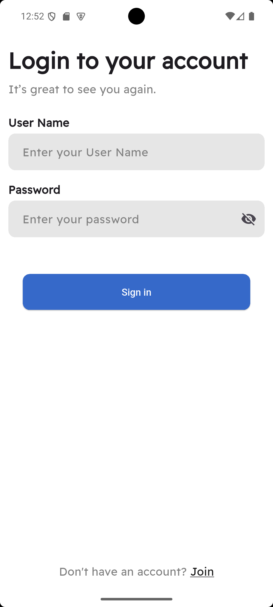
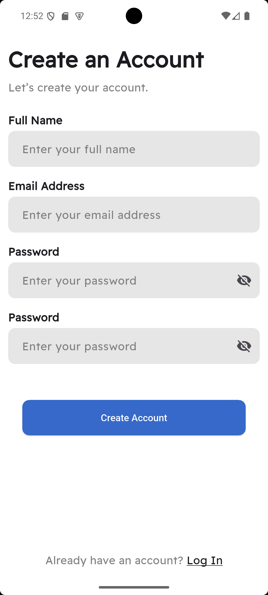
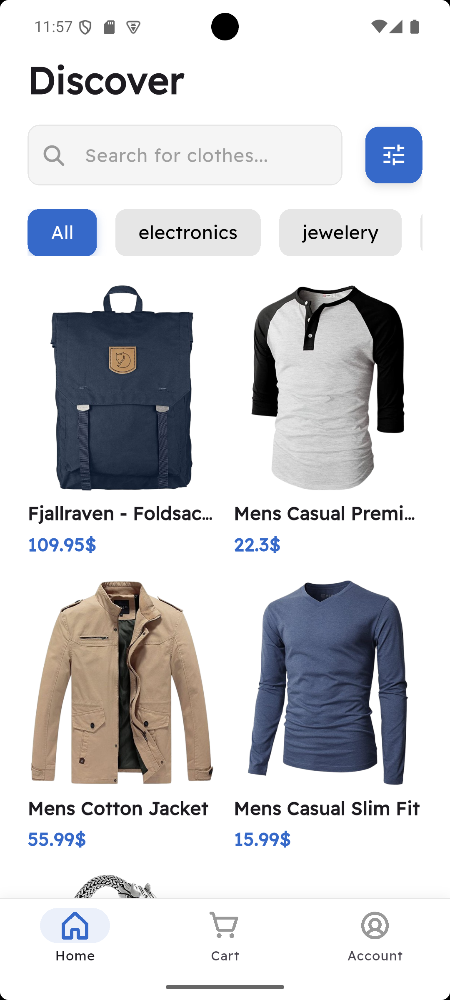
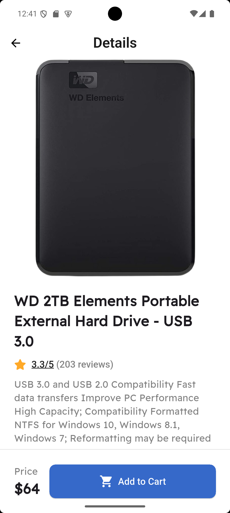
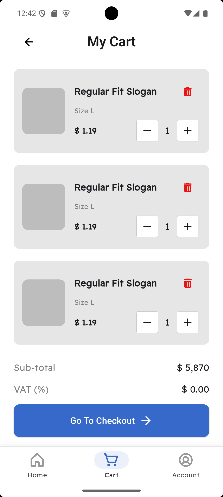
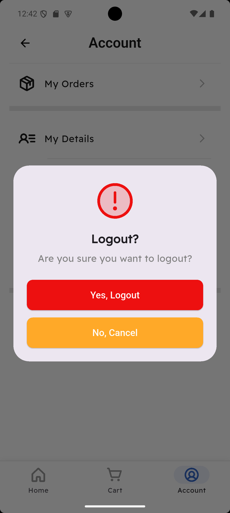

# 🛍️ Marketi

**Marketi** is a modern and elegant Flutter application designed to provide a seamless shopping experience with a clean user interface and smooth performance.  
It’s built with scalability, modularity, and maintainability in mind.

---

## 🚀 Features

- ✅ Beautiful and responsive UI design  
- ✅ State management with clean architecture  
- ✅ Local data caching using **Flutter Secure Storage**  
- ✅ Smooth navigation with **GoRouter**  
- ✅ Custom reusable widgets  
- ✅ Integration-ready for REST APIs  

---

## 🧩 Project Structure

```

lib/
├── core/
│   ├── router/
│   ├── theme/
│   ├── utils/
│   └── constants/
├── features/
│   ├── auth/
│   ├── home/
│   ├── cart/
│   └── profile/
├── widgets/
└── main.dart

````

This structure keeps the app modular, scalable, and easy to maintain.

---

## 🧠 Tech Stack

| Layer | Technology |
|-------|------------|
| Framework | Flutter |
| Language | Dart |
| State Management | Provider / Cubit |
| Routing | GoRouter |
| Local Storage | Flutter Secure Storage / SharedPreferences / Sqflite |
| UI Toolkit | Material 3 |

---

## ⚙️ Installation & Setup

1. **Clone the repository**
   ```bash
   git clone https://github.com/yourusername/marketi.git
   cd marketi
````

2. **Install dependencies**

   ```bash
   flutter pub get
   ```

3. **Run the app**

   ```bash
   flutter run
   ```

---

## 🧪 Folder Highlights

* **core/** → Global configuration (themes, routes, constants)
* **features/** → Modular feature-based code organization
* **widgets/** → Shared custom widgets used across the app

---

## 🎨 UI Showcase (Selected & Organized)

I selected a few representative screenshots and organized them into a clean 2×2 grid for better visual reading.
<table>
  <tr>
    <td align="center">
      
      <div><strong>Login</strong></div>
    </td>
      <td align="center">
      
      <div><strong>Register</strong></div>
    </td>
    <td align="center">
      
      <div><strong>Home Screen</strong></div>
    </td>
    <td align="center">
      
      <div><strong>Product Details</strong></div>
    </td>
  </tr>
  <tr>
    <td align="center">
      
      <div><strong>Cart Screen</strong></div>
    </td>
    <td align="center">
      
      <div><strong>Logout Dialog</strong></div>
    </td>
  
  </tr>
</table>


## 💡 Future Plans

* 🔗 Integration with backend API
* 🧭 Product filters and search
* 💳 Payment gateway integration
* ✨ Advanced animations and transition effects

---

## 👨‍💻 Author

**Ahmed Alaayq**
📧 [ahmed.alaayq@gmail.com](mailto:ahmed.alaayq@gmail.com)
💼 [LinkedIn – Ahmed Alaayq](https://linkedin.com/in/ahmed-alaayq)

---

> 🧠 “Great design is born of simplicity and clarity.”
